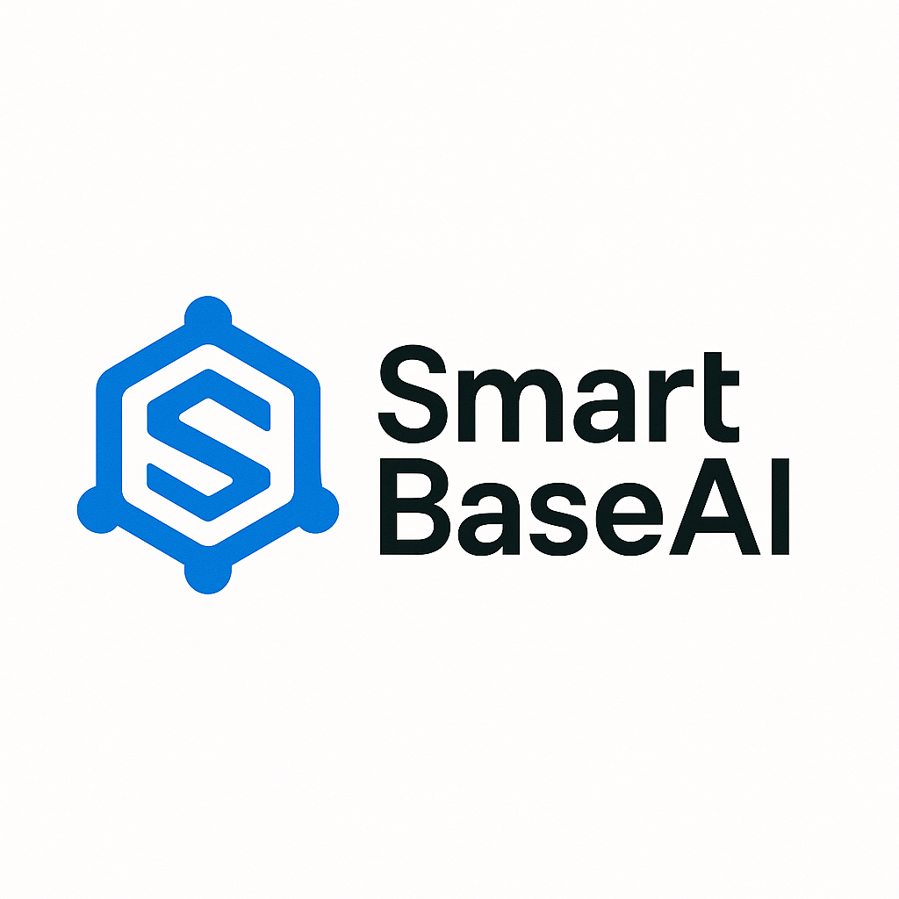
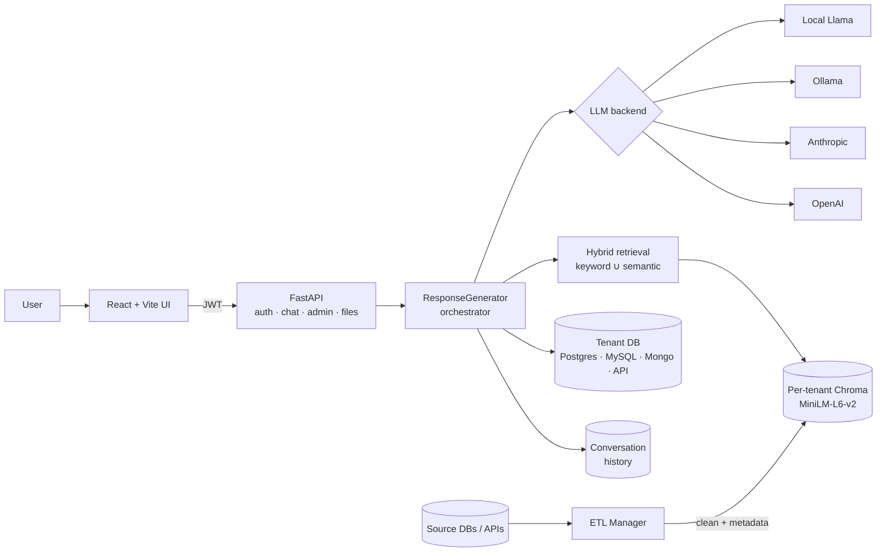

<p align="center">
  
</p>

<h1 align="center">SmartBaseAI</h1>

<p align="center">
  <em>A multi-tenant LLM platform that grounds answers in <b>both</b> your structured databases <b>and</b> your unstructured documents.</em>
</p>

<p align="center">
  <a href="#quickstart">Quickstart</a> ·
  <a href="#architecture">Architecture</a> ·
  <a href="#demo">Demo</a> ·
  <a href="#tech-stack">Tech stack</a> ·
  <a href="#contact">Contact</a>
</p>

---

## What is it

SmartBaseAI is an open-source backend + web UI for building chat experiences over private knowledge bases. Unlike a vanilla RAG starter, every chat turn runs through an **orchestrator** that merges three sources before calling the LLM:

1. **Conversation history** — maintained per session.
2. **Exact structured lookups** — the orchestrator detects entities in the user's message (e.g. an ISO date) and pulls the matching row from the tenant's SQL / Mongo / API source.
3. **Hybrid RAG** — per-tenant Chroma store with keyword ∪ semantic retrieval over uploaded documents.

Each tenant is isolated: its own persistent vector store, its own DB connector, its own model backend. LLMs are pluggable — **OpenAI, Anthropic, Ollama, or a local Llama** — so a tenant can run fully on-prem or fully hosted without code changes.

Built for environments where "hallucinate a close price" is not acceptable: the exact DB row is preferred, RAG is treated as supplemental context, and the fallback is an explicit `"No information"` rather than a fabricated answer.

## Demo

<!-- TODO: replace with actual recording -->
<p align="center"><i>Demo GIF coming soon — see <a href="docs/screenshots/">docs/screenshots/</a>.</i></p>

## Quickstart

**Requirements:** Python 3.10+, Node 18+, optionally a running Ollama instance (`ollama pull llama3`) or an OpenAI / Anthropic API key.

```bash
# 1. Clone
git clone https://github.com/danrixd/smartbaseai.git
cd smartbaseai

# 2. Configure
cp .env.example .env
# edit .env: set SECRET_KEY and (optionally) OPENAI_API_KEY / ANTHROPIC_API_KEY

# 3. Backend
pip install -r requirements.txt
python scripts/run_server.py --reload    # http://localhost:8000

# 4. Frontend (in a second terminal)
cd frontend
npm install
npm run dev                                # http://localhost:5173
```

Open <http://localhost:5173>, log in, pick a tenant, and start chatting. The default admin credentials live in `.env.example` — change them before exposing the service.

### Creating a tenant

```bash
python scripts/setup_tenant.py tenant1 \
    --name "Tenant 1" \
    --db-type postgres \
    --db-config '{"host": "localhost", "user": "app"}' \
    --model-type ollama --model-name llama3
```

### Ingesting documents

```bash
python scripts/build_embeddings.py \
    --source docs/ \
    --output embeddings.json \
    --embedder local
```

### Running the tests

```bash
pip install -r requirements.txt
pytest -q
```

## Architecture



Full write-up: **[docs/architecture.md](docs/architecture.md)**.

Key files if you want to read the code:

- `chatbot/response_generator.py` — the three-source orchestrator.
- `ai/rag_pipeline.py` — tenant-aware RAG with FAISS fallback.
- `ai/vector_stores/chroma_store.py` — persistent per-tenant store with hybrid query.
- `ingestion/etl_manager.py` — pluggable DB connectors → clean → metadata → store.
- `api/app.py` — FastAPI entrypoint; routers under `api/routes_*.py`.

## Tech stack

| Layer        | Choice                                                           |
|--------------|------------------------------------------------------------------|
| Backend      | Python 3.10+, FastAPI, Pydantic, JWT auth, pytest                |
| Retrieval    | ChromaDB (persistent), sentence-transformers `all-MiniLM-L6-v2`, FAISS fallback, hybrid keyword + semantic |
| LLMs         | OpenAI, Anthropic, Ollama, local Llama — pluggable via `ai/models/` |
| Data sources | Postgres, MySQL, MongoDB, generic HTTP APIs                      |
| Frontend     | React 19, Vite, Tailwind, React Router, Axios                    |
| Infra        | GPU auto-detected for embeddings (CUDA → CPU fallback)           |

## Example API usage

```bash
# 1. Authenticate
curl -X POST -H "Content-Type: application/json" \
     -d '{"username": "admin", "password": "ChangeThis123!"}' \
     http://localhost:8000/auth/login

# 2. Chat
curl -H "Authorization: Bearer <token>" \
     -H "Content-Type: application/json" \
     -X POST http://localhost:8000/chat/message \
     -d '{"session_id": "s1", "tenant_id": "tenant1", "message": "What was the close on 2024-03-15?"}'
```

## Project status

Active personal project. See [CHANGELOG.md](CHANGELOG.md) for milestones and [TODO.md](TODO.md) for the backlog.

## Contact

Built by **Dan Ringart** — algorithm developer, B.Sc. Physics (Tel Aviv University). Background in simulations, quant trading systems, and LLM-orchestrated platforms.

- Website: [danringart.com](https://danringart.com)
- GitHub: [@danrixd](https://github.com/danrixd)

Feedback, issues, and PRs welcome.

## License

MIT — see [LICENSE](LICENSE).
