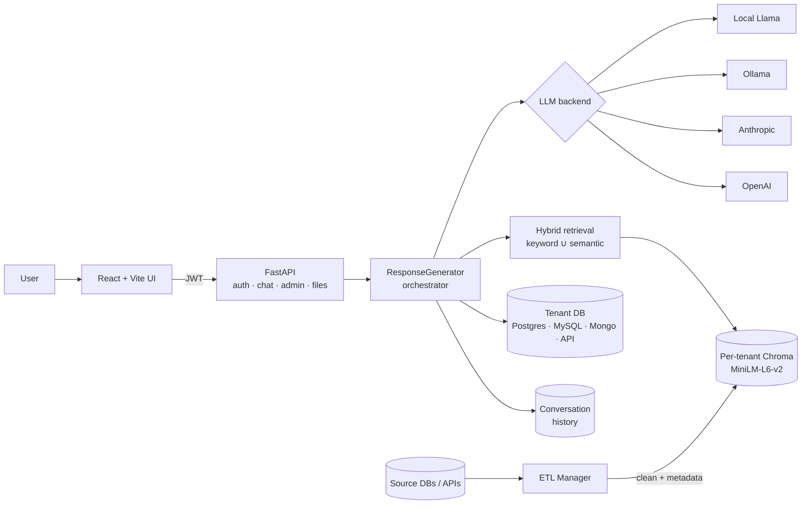

# SmartBaseAI — Architecture

SmartBaseAI is a multi-tenant LLM platform that grounds each chat turn in **three** data sources: conversation history, an exact row lookup against the tenant's structured database, and hybrid retrieval over the tenant's document store. The result is a single prompt in which verifiable facts take precedence over free-form context.

## High-level flow



## Request lifecycle

A `POST /chat/message` call flows through the following stages:

1. **Auth** — `auth_middleware.get_current_user` decodes the JWT and loads the user from `data/system.db`. Non-super-admin users can only chat within their own tenant (`routes_chat.chat_message`).
2. **Tenant config lookup** — `TenantManager.get(tenant_id)` reads `tenants/tenants.json` on every call (no in-memory cache) and returns the tenant's `model_type`, `model_name`, and DB config.
3. **Session update** — the incoming message is appended to both the in-memory `ConversationManager` and the persistent `conversation_repository` (SQLite).
4. **Orchestration** — a fresh `ResponseGenerator` is built per request with the tenant's `model_type`. It calls three helpers in sequence:
   - `_lookup_db(message)` — regex-matches an ISO datetime (`YYYY-MM-DD HH:MM`), then `exact_lookup` pulls the matching row from `data/<tenant>.db#market_data`. Returns a formatted one-liner or `""`.
   - `_search_rag(message)` — delegates to `RAGPipeline.retrieve_context`, which runs `TenantVectorStore.hybrid_query` (keyword ∪ semantic). Returns concatenated document text.
   - `_format_history(history)` — serializes the conversation history.
5. **Fusion** — `_merge_sources(db_text, rag_text)` prefers the DB hit and treats RAG as supplemental (`"{db}\n\nAdditional context:\n{rag}"`). If both are empty the reply is an explicit `"No information"` rather than a hallucination.
6. **Generation** — `_build_prompt` assembles `Conversation / Context / User / Assistant:` and sends it to the tenant's configured model (`OllamaModel` / `OpenAIModel` / `AnthropicModel` / `LocalLlamaModel`).
7. **Persistence + audit** — the reply is appended to both conversation stores and an action row is written to `audit_log_repository`.

## Multi-tenancy model

- **Config:** `tenants/tenants.json` — one entry per tenant with model type, name, DB type, and DB config. Read on every request so changes via the admin API take effect immediately.
- **Vector store:** `vector_store/<tenant_id>/` — persistent Chroma collection per tenant. Uses `sentence-transformers/all-MiniLM-L6-v2` with CUDA if available, CPU fallback. Hybrid query combines exact keyword matches with semantic top-k.
- **Structured DB:** `data/<tenant_id>.db` (SQLite in dev) or an external Postgres / MySQL / Mongo / HTTP API via `db/connectors/`. The `exact_lookup` fast path is used when the user's message contains a date.
- **Auth:** `users.tenant_id` scopes every request. `super_admin` has cross-tenant access; `admin` is tenant-scoped; `user` is tenant-scoped and cannot manage users.
- **File uploads:** `POST /files/upload` stores the raw file under `data/uploads/<tenant>/<user>/` **and** — for supported text formats (`.txt`, `.md`, `.csv`, `.log`) — pushes the content into the tenant's Chroma store, so uploaded docs are immediately searchable.

## Ingestion pipeline (`ingestion/etl_manager.py`)

For bulk loads from source systems (rather than user uploads):

```
source (Postgres / MySQL / Mongo / HTTP API)
   → ETLManager.extract  (connector.execute)
   → ETLManager.transform (cleaners.clean_text + metadata_generator)
   → ETLManager.load      (→ tenant vector store)
```

Each connector implements a uniform `connect / execute / close` interface (`db/connectors/*.py`), making it straightforward to add new sources.

## Layering

| Layer            | Modules                                                                 |
|------------------|-------------------------------------------------------------------------|
| API              | `api/app.py`, `api/routes_*.py`, `api/auth_middleware.py`, `api/config.py` |
| Orchestration    | `chatbot/response_generator.py`, `chatbot/conversation_manager.py`, `chatbot/intent_recognition.py` |
| Retrieval        | `ai/rag_pipeline.py`, `ai/vector_stores/{chroma_store,faiss_store,pinecone_store}.py`, `ai/embeddings/*.py` |
| LLM backends     | `ai/models/{openai_model,anthropic_model,ollama_model,local_llama_model}.py`, `ai/model_manager.py` |
| Data access      | `db/query_engine.py`, `db/connectors/*.py`, `db/{user,file,conversation,audit_log}_repository.py` |
| Ingestion        | `ingestion/etl_manager.py`, `ingestion/cleaners.py`, `ingestion/metadata_generator.py` |
| Multi-tenancy    | `tenants/tenant_manager.py`, `tenants/tenant_storage.py`                |
| Frontend         | `frontend/src/**` (React 19, Vite, Tailwind, React Router, Axios)       |

## Design notes

- **DB-preferred fusion.** The orchestrator treats exact structured lookups as ground truth and RAG as supplemental context. This matters in domains where hallucinating a numeric answer is unacceptable (finance, ops, analytics) — the LLM sees the authoritative row *before* the retrieved prose.
- **Explicit `"No information"` fallback.** When both sources are empty, the system does not call the LLM at all. This is a deliberate guardrail against fluent-but-wrong answers.
- **Hybrid retrieval over pure semantic.** `TenantVectorStore.hybrid_query` unions keyword hits with semantic top-k, deduplicating by document identity. This recovers exact-match queries that embeddings miss (codes, IDs, acronyms).
- **Stateless tenant manager.** `TenantManager` re-reads `tenants.json` on every call. Simpler and avoids a stale-cache class of bug that previously caused newly-created tenants to be invisible to the chat route until a restart.
- **Per-tenant persistence isolation.** Each tenant's Chroma store lives in its own directory; each tenant's structured SQLite lives in its own file. No query joins across tenant boundaries are possible.
